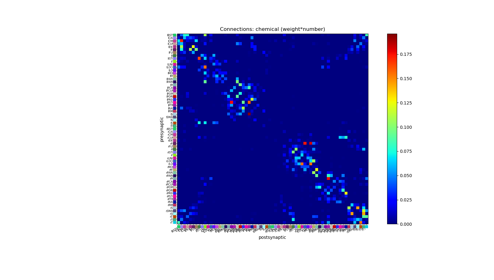
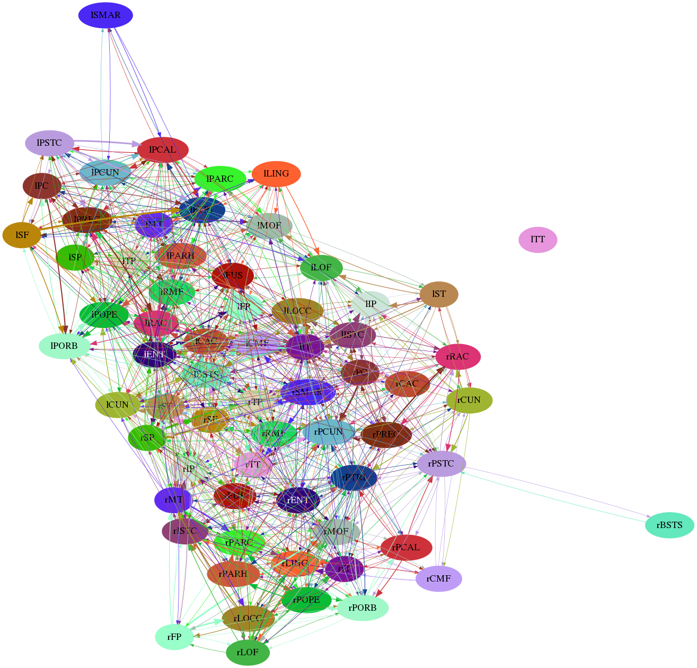

## Testing TVB data import

### Hagmann et al. 2008

Based on example here: https://github.com/JohnGriffiths/temp_tvb_tutorials

The data can be imported & converted to NeuroMLlite format with:

    python manual_import.py

It will require installation of [NeuroMLlite](https://github.com/NeuroML/NeuroMLlite).

Try:

    python manual_import.py -nml      # Generate NeuroML v2 files
    python manual_import.py -matrix1  # Generate matrix shown below
    python manual_import.py -graph2f  # Generate graph shown below

 

The generated NeuroML file can also be loaded into OSB for visualisation [link](http://opensourcebrain.org/projects/connectivityshowcase/models?explorer=https%253A%252F%252Fraw.githubusercontent.com%252FOpenSourceBrain%252FConnectivityShowcase%252Fmaster%252FTVB%252FHagmannetal2008.net.nml):

